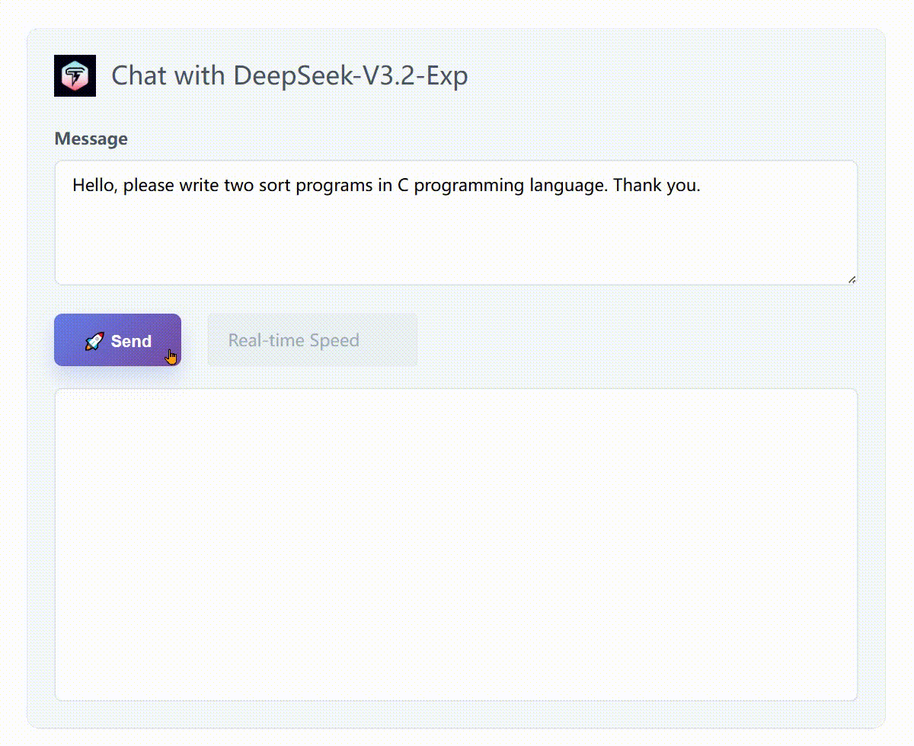

<div align="center">
  
  <h1>TileRT: Tile-Based Runtime for<br>Ultra-Low-Latency LLM Inference</h1>
  <p>
    <a href="https://pypi.org/project/tilert/"></a>
    <a href="https://huggingface.co/Tile-AI/DeepSeek-V3.2-Exp-TileRT"></a>
  </p>
  <p>
    <a href="#overview"><b>Overview</b></a> ·
    <a href="#running-the-generation-example"><b>Generation</b></a> ·
    <a href="#running-the-generation-example-with-multi-token-prediction-mtp"><b>MTP Generation</b></a> ·
    <a href="#installation"><b>Installation</b></a> ·
    <a href="#news"><b>News</b></a>
  </p>
</div>

______________________________________________________________________

<a id="news"></a>

## 📰 News

- :fire: **2026-01-26 · [v0.1.2-alpha.1](https://github.com/tile-ai/TileRT/releases/tag/v0.1.2-alpha.1)**. **Multi-Token Prediction (MTP) lands in TileRT**. With mtp=3, we observe decoding rates up to **590 tokens/s** under synthetic workloads.

- ⚡ **2025-12-23 · [v0.1.1](https://github.com/tile-ai/TileRT/releases/tag/v0.1.1)**. Achieved ~**35% further reduction** (3 ~ 4x speedup over baseline) in end-to-end token generation latency on a single node with **8× NVIDIA B200**.

- 🚀 **2025-11-20 · [v0.1.0-alpha.1](https://github.com/tile-ai/TileRT/releases/tag/v0.1.0-alpha.1)**. Initial public release for **DeepSeek-V3.2-Exp**, targeting **ultra-low-latency** inference. Available on [PyPI](https://pypi.org/project/tilert) and [HuggingFace](https://huggingface.co/Tile-AI/DeepSeek-V3.2-Exp-TileRT).

______________________________________________________________________

<a id="overview"></a>

## TileRT: Pushing LLM Latency to the Limit

TileRT is an experimental project exploring core compiler techniques for serving large language models (LLMs) in **ultra-low-latency** scenarios. Its goal is to push the latency limits of LLMs without compromising model size or quality—for example, enabling models with hundreds of billions of parameters to achieve millisecond-level **time per output token (TPOT)**.

<p align="center">
<br>
Figure 1. Sequence generation with TileRT, now enhanced with Multi-Token Prediction (MTP) to accelerate inference.
</p>

We evaluated TileRT’s preliminary performance using the [**DeepSeek-V3.2-Exp**](https://huggingface.co/deepseek-ai/DeepSeek-V3.2-Exp) model (without lossy optimizations such as quantization or distillation) with a batch size of 1 on 8× NVIDIA B200 GPUs. As shown in the benchmark below, TileRT demonstrates substantial improvements over existing inference systems.

<p align="center">
<br>
Figure 2. Evaluation setup. Batch size: 1, Input sequence length/Output sequence length: 1K/1K; SGLang v0.5.6, TensorRT-LLM v1.2.0-rc5, vLLM v0.13.0, TileRT v0.1.1 with CUDA 12.9.
</p>

Unlike traditional inference systems optimized for high-throughput batch processing, TileRT prioritizes **responsiveness**, which is critical for applications such as high-frequency trading, interactive AI, real-time decision-making, long-running agents, and AI-assisted coding, where the latency of individual requests matters most.

To achieve this, TileRT introduces a **tile-level runtime engine**. Leveraging a compiler-driven approach, LLM operators are decomposed into fine-grained tile-level tasks, while the runtime dynamically reschedules computation, I/O, and communication across multiple devices in a highly overlapped manner. This design minimizes idle time and improves hardware utilization.

The project is actively evolving, and the underlying compiler techniques will be gradually shared with the community as they are integrated into **TileLang** and **TileScale**.

______________________________________________________________________

## Installation

- [Prerequisites](#prerequisites)
- [Python Package Installation](#python-package-installation)

### Prerequisites

Before installing TileRT, ensure your environment meets the following requirements:

**Hardware Requirements**

- 8× NVIDIA B200 GPUs

**Operating System**

- Linux x86_64 (Ubuntu 20.04 or later recommended)

**Python Version**

- Python 3.11 – 3.12
  *(The wheel package is built and tested against these versions.)*

**PyTorch Build**

- PyTorch wheels compiled for CUDA 12.8 or 12.9
  *(Must match the CUDA driver/runtime version required for B200 GPUs.)*

### Python Package Installation

> \[!IMPORTANT\]
> **Disclaimer**: TileRT is an experimental project. The current pre-built package supports the 8-GPU B200 setup. For the most reliable experience, we strongly recommend installing the package within the provided Docker image.

The recommended installation method is using the pre-configured Docker image, which includes all necessary dependencies.

**Step 1: Pull the Docker image**

```bash
docker pull tileai/tilert:v0.1.0
```

**Step 2: Launch a Docker container**

```bash
IMAGE_NAME="tileai/tilert:v0.1.0"
WORKSPACE_PATH="/path/to/your/workspace"  # Replace with your actual workspace path

docker run --gpus all -it \
    -v $WORKSPACE_PATH:/workspace/ \
    $IMAGE_NAME
```

**Step 3: Install the TileRT package**

Once inside the container, install TileRT using pip:

```bash
pip install tilert
```

You're now ready to use TileRT! Proceed to the [Getting Started](#getting-started) section to download model weights and run your first inference.

## Getting Started

### Download Pre-Converted Weights from HuggingFace

TileRT requires preprocessing of the original DeepSeek-V3.2-Exp model weights before they can be used for ultra-low-latency inference.
To simplify this process, we provide **pre-converted weights** directly on HuggingFace so users do not need to run the preprocessing pipeline themselves.

You can download the weights using one of the recommended methods below:

#### Option 1: Using `huggingface-cli` (recommended)

```bash
hf download Tile-AI/DeepSeek-V3.2-Exp-TileRT --local-dir ./tilert_weights
```

This will download all files into the `./tilert_weights` directory.

#### Option 2: Using Git + Git LFS

```bash
git lfs install
git clone https://huggingface.co/Tile-AI/DeepSeek-V3.2-Exp-TileRT
```

For additional download methods or advanced usage, please refer to the official Hugging Face documentation.

After downloading the weights, point TileRT to the directory using:

```bash
export MODEL_WEIGHTS_DIR=/path/to/tilert_weights
```

### Running the Generation Example

After downloading the model weights, you can run the generation example within the Docker environment as follows:

```bash
MODEL_WEIGHTS_DIR="/path/to/tilert_weights"

docker run --gpus all -it \
    -v $WORKSPACE_PATH:/workspace/ \
    -v $MODEL_WEIGHTS_DIR:$MODEL_WEIGHTS_MOUNT \
    tilert:v0.1.0
```

Once inside the container, run the following Python script to perform text generation:

```python
from tilert.models.deepseek_v3_2.dsa_show_hands import ShowHandsGenerator

generator: ShowHandsGenerator = ShowHandsGenerator(
    max_new_tokens=1000,
    model_weights_dir=MODEL_WEIGHTS_DIR,
    with_mtp=False,  # Disable MTP
)
generator.from_pretrained()

prompt = (
    "Tell me three jokes:\n\n"
    "1. A dad joke,\n"
    "2. A programmer joke,\n"
    "3. A joke that only makes sense if you've ever tried "
    "to train a large language model.\n"
    "Keep each joke under 15 words."
)

print("Prompt:", prompt)
print("Completion:")
completion = generator.generate(prompt)
```

For example, TileRT may generate:

<details>
<summary><b>Sample output (click to expand)</b></summary>

```text
1. I'm afraid for the calendar. Its days are numbered.
2. There are only 10 kinds of people: those who understand binary and those who don't.
3. My model's loss is low, but its answers are still nonsense. Overfitting.
```

</details>

This example demonstrates basic single-step autoregressive generation using the precompiled model.

### Running the Generation Example with Multi-Token Prediction (MTP)

> \[!IMPORTANT\]
> **Weights update required for MTP.** Multi-Token Prediction (MTP) introduces additional **MTP heads** in the model weights.
> If you were using TileRT **before v0.1.1**, please make sure you download the **latest weights** from Hugging Face.
> Older weights do not include the required MTP heads and will fail to run when MTP is enabled.

TileRT also supports Multi-Token Prediction (MTP), which allows the model to generate multiple tokens per forward pass and reduces sequential decoding depth.

To better illustrate MTP behavior, we use a longer prompt that encourages extended generation:

```python
from tilert.models.deepseek_v3_2.dsa_show_hands import ShowHandsGenerator

generator: ShowHandsGenerator = ShowHandsGenerator(
    max_new_tokens=1000,
    model_weights_dir=MODEL_WEIGHTS_DIR,
    with_mtp=True,  # Enable MTP
)
generator.from_pretrained()
prompt = "Tell me 10 jokes, keep them all under 100 words."

print("Prompt:", prompt)
print("Completion:")
completion = generator.generate(prompt)
```

When MTP is enabled, TileRT may report statistics similar to the following during generation:

```text
Accepted length: mean=2.77, min=1, max=4
```

This indicates that, on average, multiple tokens are accepted per decoding step under MTP.

<details>
<summary><b>Sample output (click to expand)</b></summary>

```text
Of course! Here are 10 short jokes for you.

1. I told my wife she was drawing her eyebrows too high. She looked surprised.

2. I invented a new word: Plagiarism.

3. Why don't scientists trust atoms? Because they make up everything.

4. I'm reading a book on anti-gravity. It's impossible to put down.

5. What's the best thing about Switzerland? I don't know, but the flag is a big plus.

6. I told my computer I needed a break, and now it won't stop sending me vacation ads.

7. Why did the scarecrow win an award? He was outstanding in his field.

8. What do you call a fake noodle? An impasta.

9. I told my suitcase there's no vacation, and now it has a lot of baggage.

10. Why don't skeletons fight each other? They don't have the guts.
```

</details>

This example highlights how MTP enables TileRT to efficiently generate longer outputs by accepting multiple tokens per decoding step, while preserving the same Python API interface.

For more details, please refer to the [generation script](https://github.com/tile-ai/TileRT/blob/main/python/generate.py).

## Status & Future Work

TileRT is currently offered as a preview release, and we’re just getting started.
We are continuously improving the installation experience and enhancing end-to-end performance. Future releases will keep pushing the boundaries of low-latency generation.

Thank you for your interest and support — stay tuned, even faster token generation is on the way!
